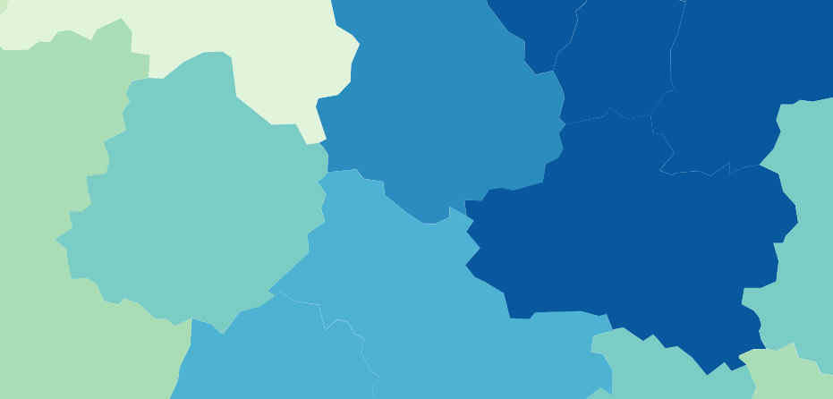

<!--
title: atelier Khartis Stretching Numérique

email: damien.belveze@univ-rennes1.fr 

language: fr 

comment: ce support a été présenté dans le cadre du Stretching Numérique (https://stretchingnumerique.fr) le 17 mars 2023
-->

# Utiliser Khartis pour cartographier des données

[](https://liascript.github.io/course/?https://raw.githubusercontent.com/damienbelveze/atelier_khartis/main/SN_khartis.md#1)


*15 mars 2023*

CC:by Damien Belvèze

<!--width="30%"-->

## Introduction

Khartis va vous permettre de créer des cartes thématiques. C'est un outil libre développé par l'atelier cartographie de Sciences Po.

Il existe 2 versions[^1] :

- une [version en ligne](https://www.sciencespo.fr/cartographie/khartis/app/project/new/step1)
- une [version à télécharger](https://www.sciencespo.fr/cartographie/khartis/#download)
    

En 3 points, cet outil vous permet de :

- télécharger des données et les mettre en forme  
- utiliser 8 types de visualisations différents  
- mettre en forme votre carte et la télécharger  

[^1]: Dans sa version actuelle, l'application téléchargeable ne permet pas de disposer de toutes les fonctionnalités disponibles sur l'application en ligne.

## Charger les données dans Khartis

Où trouver des données ? Par exemple : INSEE, Banque Mondiale ou Statista

A cette étape, prenez le temps de nettoyer le fichier pour ne conserver que les données pertinentes pour votre travail afin de ne pas alourdir la représentation finale de la carte.

Choisir le fond de carte en fonction des données. Si vous ne trouvez pas la carte qui correspond, vous pouvez en télécharger une dans Khartis dans la partie "Importer son propre fond".

A partir de là 3 possibilités :

- enregistrer les données au format .csv sur son ordinateur, et les télécharger dans la partie "Télécharger le modèle (.csv)"  
- glisser/déplacer les données directement dans le cadre intitulé "Choix des données"  
- copier/coller les données directement dans le cadre "Choix des données"  

### Visualisations disponibles

<!--width="30%"-->

**carte choroplèthe** (terme inventé par le Géographe Américain John K. Wright) : carte représentant des quantités (ou des qualités ordonnées) au moyen de variations de couleurs ou de symboles
de χορα territoire et πλεθος quantité

outils numériques pour réaliser des choroplethes :

- Khartis  
- [Bertin.js](https://observablehq.com/collection/@neocartocnrs/bertin)  
- [philocarto](http://philcarto.free.fr/01_bienvenue/01_bienvenue.html)    

#### Choix de visualisation pour représenter l'ordre

| symbole | descriptif|
|:--:|:--:|
| <!--width="80%"--> | Symboles proportionnels : pour illustrer des quantités (nombre, stocks, valeurs, ...), pour comparer. |
| <!--width="80%"--> | Couleurs ordonnées : pour faire ressortir les ponts positifs ou négatifs. Pour figurer des ordres de grandeur |
| <!--width="80%"--> | Symboles ordonnés : pour montrer une hiérarchie, un ordre |

#### Choix de visualisation pour représenter des différences

| symbole | descriptif|
|:--:|:--:|
| <!--width="80%"--> | Symboles différents : pour figurer des ressemblances ou des différences entre les données qualitatives. |
| <!--width="80%"--> | Couleurs différentes : pour figurer des ressemblances ou des différences entre les données qualitatives. |

Ces visualisations permettent de mieux distinguer les catégories d'une variable.

#### Choix de visualisation pour combiner des variables

| symbole | descriptif|
|:--:|:--:|
| <!--width="80%"--> | Symboles proportionnels colorés (ordre) : pour montrer l'évolution entre deux dates (couleur) d'un phénomène (taille des symboles) |
| <!--width="80%"--> | Symboles proportionnels colorés (différence) : pour montrer la géographie d'un phénomène qualitatif (couleur) et en même temps des différences (taille) |
| <!--width="80%"--> | Double symboles proportionnels : pour comparer deux informations. Pour figurer deux quantités mais les tailles par défaut ne seront pas comparables |

## Exemple : espèces menacées et zones protégées

Télécharger le fichier de données ([données](especes_menacees.xls))

Réaliser une carte de l'Europe avec les visualisations suivantes :

- Espèces menacées : symbole proportionnels (ronds rouge)

- Zones protégées : couleurs ordonnées (couleurs froides)

Votre travail final doit ressembler à cela: 


## Comment exporter des cartes de Khartis ? 

!?[](https://youtu.be/QfpT4l1KJyE)

## Où trouver les fonds de carte qui me manquent dans Khartis ?

Khartis permet d'importer ses propres fonds de carte sous trois formats : geojson, topojson ou shapefile (.shp +.dbf +.prj)

Les fonds de carte sont disponibles en Geojson ou en Shapefile (fichiers produits avec des éditeurs de cartes libres comme QGIS)

### Répertoires de cartes libres

On peut chercher des cartes en format Shapefile en utilisant Google. Le filtre type de fichier (filetype:shp) en fonctionne guère, donc on aura plutôt intérêt à réaliser une recherche dans Google du type [Berlin shapefile](https://www.google.com/search?hl=fr&q=berlin%20shapefile)

Il existe également sur le web des répertoires de cartes disponibles librement:

Les fonds de carte des différents pays sont disponibles en *geojson* sur le [site Geojson Maps](https://geojson-maps.ash.ms/)

Toutefois sur ce site, nous n'avons pas accès aux cartes administratives de chaque pays, seulemet aux cartes des pays eux-mêmes, sans subdivisions. Supposons que nous souhaitions visualiser la production hydroélectrique de la Chine province par province, nous ne pourrions pas le faire avec la carte de Chine importable de GeoJson Maps.

Il existe d'autres banques de fonds de carte utilisables librement sur le web. Nous allons utiliser ici le [site GADM](https://gadm.org/) qui met à disposition des fonds de carte de pays avec leurs subdivisions administratives.

Dans la liste des pays disponibles sur GADM, il nous faut d'abord chercher celui qui nous intéresse. Prenons comme exemple la Chine :

<!--width="80%"-->

### Le format Shapefile

Puis il faut cliquer sur Shapefile (les fichiers Geopackage ne sont pas supportés par Khartis) : nous allons télécharger une archive comportant la carte dont nous avons besoin. En décompressant l'archive (par exemple avec 7zip), nous obtenons la liste de fichiers suivante :


Les 31 provinces chinoises forment le premier niveau de subdivision administrative de la Chine.

L'arborescence du dossier reflète cette organisation :

0 = pays, 1= 1ère subdivision (province ou région), 2=2ème subdivision (canton ou département), etc.

Si l'on s'en tient aux provinces, les fichiers qu'il va falloir charger dans Khartis sont donc les suivants :

```text
gadm36_CHN_1.prj

gadm36_CHN_1.shp

gadm36_CHN_1.dbf
```

Avant de les importer dans Khartis, comme dans les cas évoqué plus haut, nous devons déterminer quelle variable ("indice") nous allons utiliser pour croiser ce fonds de carte avec nos données. Pour cela nous devons ouvrir le fichier dbf et noter le nom de la colonne dont les données se rapprochent le plus possible des données de notre tableau (notre source de vos données étant occidentale, nous allons sélectionner les noms translittérés de la colonne NAME_1), puis, s'il le faut, nous devrions ensuite modifier dans notre jeu de données les noms de provinces qui n'auraient pas été translittérés de la même manière que dans le fichier *dbf*.

Il n'y a pas de problème à simplifier la définition du fonds de carte pour faciliter le fonctionnement de Khartis, particulièrement si on travaille sur des zones étendues comme des départements français et a fortiori des provinces chinoises.

Notre fonds de carte importé de GADM est désormais prêt sur Khartis : il ne nous reste plus qu'à entrer nos données.


Pour importer son propre fonds de carte, suivre la [procédure disponible](https://www.sciencespo.fr/cartographie/khartis/docs/importer-propre-fond/index.html) sur la documentation de Khartis

## Exercice : cartographier des différences de revenus 

Objectif : faire un diagramme présentant la proportion des hauts et bas revenus dans les communes de Rennes Métropole.

### Trouver des fichiers Shapefile 

Faire une recherche sur Google à la recherche de données 

```text
filetype:shapefile Rennes Métropole
```  
### Lier le fonds de carte avec les données

C’est le code postal qui va permettre de lier les données au fonds de carte. Il faut que l’entête soit le même dans les deux cas.

Saisir *POSTAL* comme variable pivot

Copier-coller les données du fichier INSEE dans l’espace prévu à cet effet.

### Créer une visualisation 

Créer une visualisation Ajouter une visualisation > choisir une variable (choisir la variable hauts revenus)

Par exemple, pour montrer la proportion entre hauts et bas revenus (laissons les revenus intermédiaires de côté), choisir la visualisation “doubles symboles proportionnels” Dans les préférences de visualisation, laisser cercle, laisser les couleurs.

Il faut choisir deux variables : choisissez dans le menu déroulant “part des bas revenus” et “part des hauts revenus”

Les valeurs s’affichent sur le fond de carte.

---

<!--width="80%"-->


